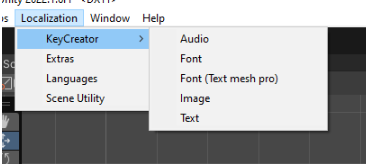
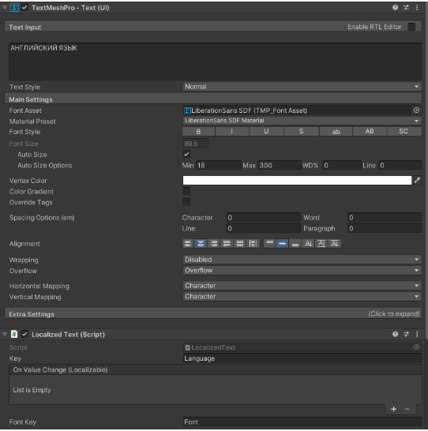
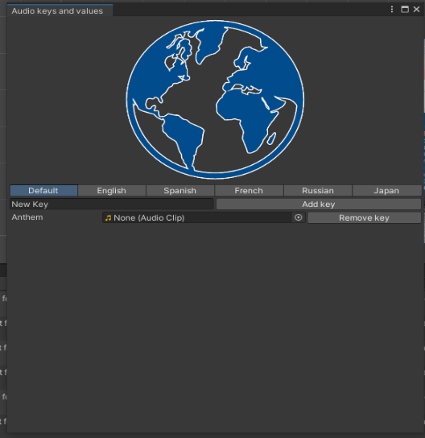
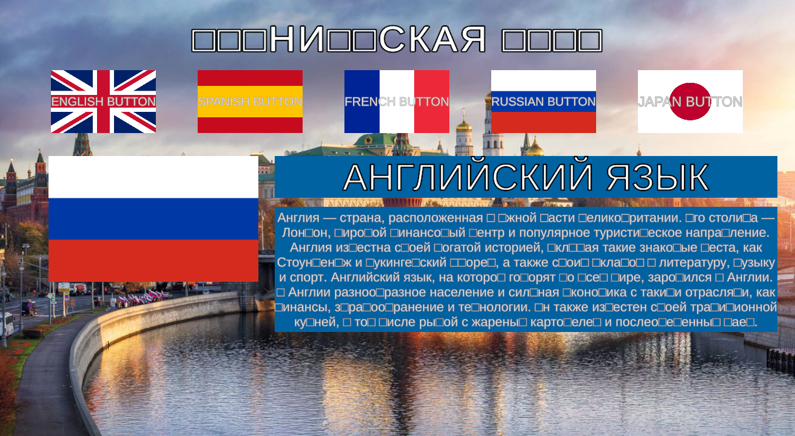
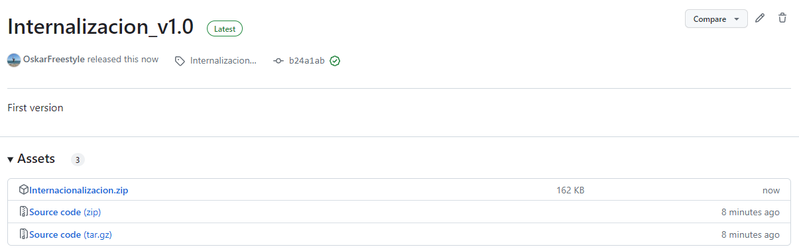
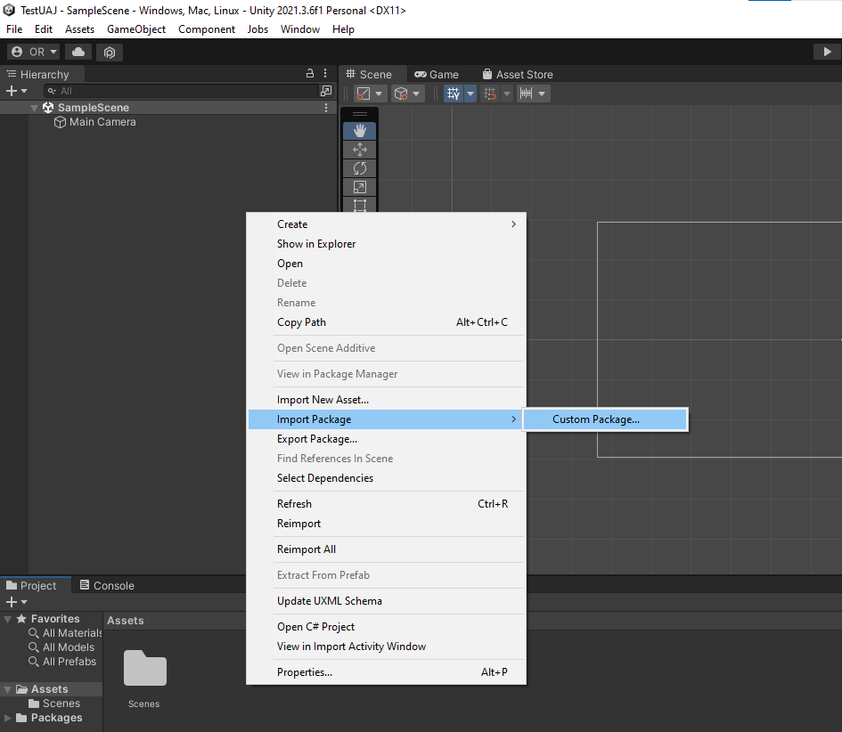
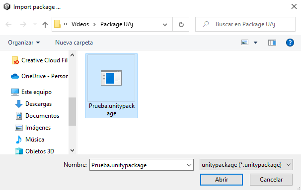
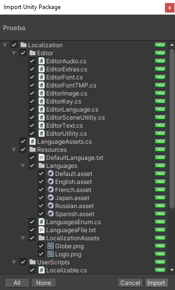
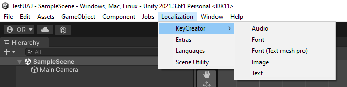

# Localizacion-Subtitulos
Ampliación del proyecto original (Internacionalización). Soporte para localizar subtítulos.

# Pablo Fernández Álvarez

# Resumen

Crear una herramienta de internacionalización y localización, en Unity. La localización implica traducir los textos, diálogos y subtítulos al idioma de destino, así como adaptar los gráficos y elementos culturales, como nombres de personajes o referencias culturales, para asegurar que sean apropiados para el público local. Por otro lado, la internacionalización, que consiste en el diseño y desarrollo de código para que sea fácilmente adaptable un juego a diferentes mercados y culturas. La localización e internacionalización son importantes porque permiten a los desarrolladores de videojuegos llegar a audiencias más amplias y diversificadas.

Nuestro proyecto se resume en una herramienta de localización integrada en el editor de Unity que funciona mediante un manager global basado en un diccionario de pares clave-valor.
Esta herramienta se usará a través de ventanas emergentes del editor de Unity. 

Con este sistema se podrá localizar textos, imágenes y música. Se podrán generar claves nuevas, modificar existentes o eliminar las que no se utilicen.

## Subtítulos	

En cuanto a los subtítulos, la idea es crear un motor de subtítulos sencillo, el cuál sepa procesar ficheros con la información de los subtítulos y mostrarlos en pantalla.
Al igual que con los textos, las imágenes y la música, estos subtítulos serán localizabes.

Para entender más a fondo el objetivo de este motor de subtítulos:

El motor seguirá la norma española de subtitulado para sordos UNE-153010: 2012

- Aspecto visuales:
	+ La posición de los subtítulos debe ser estática y ubicarse en la parte inferior central de la pantalla. En caso de 
	haber efectos sonores se indicará en la parte superior derecha.
	+ No se deben mostrar más de dos o tres (en caso excepcionales) líneas al mismo tiempo. Además, las líneas deben contener
	como máximo de 37 caracteres.
	+ Los subtítulos deben tener un tamaño de tal forma que sean legibles a 2,5 metros de la pantalla.
	+ Por cuestiones de visibilidad, está permitido usar un caja para los subtítulos para crear contraste con el color del fondo.

- Aspectos temporales: 
	+ La velocidad en la que se muestran los subtítulos deberá aproximarse a 15 caracteres por segundo.
	+ 

# Motivación y objetivos
En clase hemos hablado de la internacionalización y la localización pero no hemos llegado a desarrollar nada sobre ello por lo que nos pareció interesante el desarrollo de esta herramienta. Los juegos que no se adaptan a las preferencias culturales y lingüísticas de los jugadores locales pueden no ser bien recibidos, lo que puede reducir la demanda del juego y afectar negativamente las ventas, por ello pensamos que estos son procesos críticos para la industria del videojuego y de ahí su importancia. 
Hemos decidido hacerla en Unity para aprovechar sus características en el desarrollo, como por ejemplo no tener que desarrollar nosotros una interfaz gráfica. Si bien es cierto que Unity tiene ya su propio sistema de localización bastante completo hemos preferido empezar el nuestro desde cero y centrarnos en lo que sería el desarrollo del sistema de localización en vez de hacer extensiones a uno ya existente. 

Una ventaja adicional que tendrá nuestro sistema con respecto al de Unity es que podremos elegir qué idiomas utilizar. Unity tiene por defecto una lista bastante amplia de idiomas pero está limitado ya que no se puede ampliar. Esto puede suponer un problema ya que por ejemplo Unity no distingue entre español y español latino. Esto para la localización e internacionalización puede suponer un problema pero también para los desarrolladores que quieran sacar sus juegos en consolas (de esto último no podemos entrar más en detalle debido a haber firmado un NDA).

Otra ventaja que creemos que tiene nuestro sistema con respecto al de Unity es que al poder elegir nosotros los idiomas que se utilicen también podemos generar valores que no tengan porqué ser un idioma como tal. Por ejemplo, podríamos desarrollar un idioma con una versión infantil donde todas las palabras malsonantes sean sustituidas por algo más suave por ejemplo generando los idiomas ‘Spanish’ y ‘Spanish_kids’.

Lo que esperamos conseguir con este sistema de localización es una herramienta robusta con la cual se puedan localizar juegos en Unity de una forma sencilla para los desarrolladores. Sin tener que manejar por nuestra cuenta ficheros adicionales y con una interfaz entendible y cómoda. Para ello utilizaremos las herramientas que nos proporciona Unity para extender su editor y poder crear nuestras propias ventanas a través de las cuales poder generar la información necesaria para la localización.

Las ventanas que se generen estarán separadas por funcionalidad. Por lo que las ventanas que queremos que haya serán:
 - Ventana general: desde esta ventana se establecen los idiomas del juego y cuál será el idioma por defecto.
 - Ventanas de clave-valores: desde estas ventanas se establecen las claves y valores del juego. Se pueden generar nuevos, eliminar las que haya, o editar las claves para cada idioma. Habrá una ventana para textos, una para imágenes y otra para sonidos. 
 
Los objetivos específicos del proyecto incluyeron: 
 - Desarrollar una herramienta que permita la gestión de diferentes idiomas y sus respectivas traducciones. 
 - Implementar esta herramienta en la plataforma Unity para permitir la integración de las traducciones en videojuegos. 
 - Crear una interfaz de usuario intuitiva que permita a los desarrolladores gestionar fácilmente los diferentes idiomas y sus traducciones.
 - Desarrollar una arquitectura modular y escalable que permita la integración de nuevas funcionalidades en el futuro y que ayude al rendimiento del videojuego.

# Detalles de diseño/implementación

Podemos dividir la arquitectura del proyecto en dos partes:
 - Internacionalización: mayormente se encarga de la parte de la interfaz de la herramienta, recibiendo así la entrada del desarrollador, y de la gestión de la misma entrada, guardando los datos y generando las keys organizadas en ScriptableObject (LanguageAssets)

 - Localizacion: formado principalmente por la clase LocalizationManager y los Localizables (componente de los objetos que se quieran localizar) que se encargan de cambiar los diferentes componentes de los objetos en la escena al idioma que se encuentre en el videojuego.

## Internacionalización: 
Hay varias clases en esa sección y cabe destacar que todas ellas heredan de EditorWindow, para así poder usar métodos que creen estas ventanas en Unity en la barra de herramientas. Así todas las clases o sus hijas (en el caso de EditorKey) tendrás una función que se llamará al clicar en esta opción en la barra del menú, SowWindow(). Esta función utiliza TryOpenWindow() para verificar si una ventana está abierta y luego llama a GetWindow(), función que pertenece a EditorWindow para abrir una nueva ventana si no hay otra abierta. También todas las clases que tienen esta función tendrán su OnDestroy() que se llama cuando se cierra la ventana y se encarga de guardar los cambios realizados en los recursos para cada idioma y UpdateWindow() que actualiza la ventana con los idiomas disponibles y los recursos para los distintos idiomas. A continuación se refleja un resumen de las clases y sus métodos y variables más importantes: 
- EditorKey: Maneja la localización de varios tipos de recursos (texto, sprite, audio y fuente). Genera una venta (ya que la clase hereda de EditorWondow, permitiéndole crear ventanas personalizadas en el editor de Unity) que permite agregar, eliminar y cambiar las claves y valores de los recursos para los distintos idiomas. Algunos de los métodos más importantes:
 	- OnGUI(): maneja la interfaz gráfica de la ventana, permitiendo la selección de un idioma y la visualización y edición de los recursos para ese idioma.
 	- AddKey() y RemoveKey(): permite agregar y eliminar claves para los recursos de un idioma.
	- ContainsKey(): verifica si una clave existe para un tipo de recurso determinado.

Esta clase es abstracta y heredan de ella EditorAudio, EditorFont, EditorFOntTMP, EditorImage y EditorText. Estas clases visualizan las diferentes ventanas del KeyCreator y cada una ofrece funcionalidades distintas dependiendo del archivo que se quiera localizar. Todas estas clases tienen un ShowWindow() para mostrar la ventana en el editor y un Initialise() que se encarga de inicializar el tipo de recurso y el título de la ventana.

- EditorLanguage: La implementación específica del script se centra en la ventana de Unity para administrar los idiomas disponibles en el proyecto. Algunos de los métodos a destacar serían o variables más importantes:
	- defaultLanguage: almacena el índice del idioma predeterminado seleccionado en la ventana. La variable ‘languages’ es una matriz de cadenas que almacena los nombres de los idiomas disponibles.
	- AddLanguage(): muestra un botón para agregar un nuevo idioma. Cuando se hace clic en el botón, se habilita la opción para ingresar el nombre del nuevo idioma y agregarlo a la lista de idiomas disponibles.
	- OnGUI(): se encarga de dibujar la interfaz de usuario de la ventana. Muestra el botón para agregar un nuevo idioma llamando a AddLanguage(). Luego muestra una lista desplegable para seleccionar el idioma predeterminado y actualiza defaultLanguage cuando se selecciona un idioma diferente.
	- SaveChanges(): se llama cuando se guardan los cambios en la ventana. Escribe el contenido de los idiomas en un archivo de texto (LanguagesFile.txt), crea un archivo de enumeración de idiomas (LanguagesEnum.cs) y guarda el índice del idioma predeterminado en un archivo de texto (DefaultLanguage.txt). Luego, actualiza los activos en Unity llamando a AssetDatabase.Refresh().
CreateLanguageFile() y CreateLanguageEnum(): se utilizan para crear el contenido de los archivos de texto mencionados anteriormente. CreateLanguageFile() genera una cadena con los nombres de los idiomas separados por saltos de línea, y CreateLanguageEnum() genera una cadena que define una enumeración de idiomas en C#.
	- DiscardChanges(): se llama cuando se descartan los cambios en la ventana.

- EditorSceneUtility: Proporciona varias opciones para facilitar la localización de la escena actual y cambiar el idioma del administrador de localización durante el tiempo de ejecución del juego. A continuación se presenta un resumen de las principales características y funciones del código:

	- OnGUI(): Se encarga de dibujar la interfaz de usuario de la ventana de utilidad de la escena. Proporciona botones para localizar la escena actual en diferentes idiomas y cambiar el idioma del administrador de localización durante el tiempo de ejecución.
	- SetSceneLanguage(): Esta función se utiliza para establecer el idioma de la escena actual. Busca los componentes "LocalizedText" y "LocalizedImage" en los objetos de la escena y reemplaza los textos y las imágenes locales según el idioma especificado.
	- ChangeCurrentLanguage(): Esta función se utiliza para cambiar el idioma actual del administrador de localización durante el tiempo de ejecución del juego. Solo está disponible durante el modo de reproducción.
	- LocalizeCurrentScene(): Esta función se utiliza para localizar la escena actual automáticamente. Busca los componentes "Text", "TMP_Text", "Image", "SpriteRenderer" y "AudioSource" en los objetos de la escena y agrega los componentes "LocalizedText", "LocalizedImage" y "LocalizedAudio" respectivamente si aún no están presentes.
En resumen, este código proporciona una ventana de utilidad que permite localizar la escena actual en diferentes idiomas y cambiar el idioma del administrador de localización durante el tiempo de ejecución del juego.

- EditorExtras: La ventana tiene varias funcionalidades adicionales:
		-Localización de divisa a distintos idiomas, pudiendo seleccionar un icono y establecer si el icono se trata de un prefijo o un sufijo
		-Separador de decimales, pudiendo seleccionar qué cadena de caracteres usar para separar números decimales.
	Para acceder a esta funcionalidad habrá que hacerlo utilizando el LocalizationManager.

Además, esta clase también tiene funcionalidad para exportar e importar las claves y valores de texto a un formato CSV, por si interesase llevar los valores a otro programa para modificarlos.
	
. La clase EditorExtras hereda de EditorWindow para crear una ventana personalizada en el editor. El método OnGUI es utilizado para dibujar los elementos de la interfaz de usuario y el método OnDestroy se encarga de guardar los cambios realizados en los archivos de localización. La ventana también utiliza otras clases del sistema de Unity, como AssetDatabase y Resources, para cargar y guardar archivos y recursos.

- EditorUtility: clase con métodos que se usan en las clases anteriores que ayudan en la creación de ventanas, lectura de archivos y carga de archivos. Las funciones son:
	- TryOpenWindow(): Esta función comprueba si ya hay una ventana de localización abierta y, si es así, muestra un mensaje de error. Si no hay una ventana abierta, establece una variable para indicar que se ha abierto una ventana.
	- CloseWindow(): Esta función establece la variable de control de ventana a "false", lo que indica que la ventana de localización está cerrada.
	- DefaultLanguage(): Esta función lee un archivo de texto llamado "DefaultLanguage" y devuelve un entero que representa el idioma predeterminado del juego.
	- LoadLanguages(): Esta función carga un archivo de texto llamado "LanguagesFile" y devuelve un array de cadenas que representa todos los idiomas disponibles para el juego.
	- CreatelconTittle(): Esta función crea un icono de título para la ventana de localización. El icono puede ser una imagen de un globo terráqueo o un logotipo, dependiendo del tamaño de la ventana.

## Localización: 
En este apartado hablaré sobre todo del LocalizationManager, el principal responsable de administrar la localización de objetos y recursos de un proyecto, y de los Localizable, que serán los componentes que se añaden a los objetos de la escena de Unity, en ellos escribiremos la key del objeto que queremos localizar:
- LocalizacionManager: de esta clase es importante destacar estas variables y funciones:
	- localizedObjects: lista que se utiliza para almacenar objetos que deben ser localizados.
	- La constructora inicializa la lista ‘’localizedObjects’’ y carga los diccionarios de idioma predeterminados. 
	- AddLocalizable() y RemoveLocalizable(): se utilizan para agregar y eliminar objetos localizables de la lista ‘’localizedObjects’’.
	- Los métodos GetAudio(), GetFont(), GetTMPFont(), GetText() y GetSprite() se utilizan para obtener los recursos localizados correspondientes a una clave dada. Verifican si el diccionario de idioma actual contiene la clave y, si no, buscan el recurso en el diccionario de idioma predeterminado. 
	- Los métodos "DecimalSeparator" y "TranslateCurrency" se utilizan para formatear valores numéricos con el separador de decimales y símbolo de moneda correctos según el idioma actual.
En resumen, la clase LocalizationManager administra la localización de objetos y recursos en un proyecto de Unity, permitiendo cambiar el idioma y obtener los recursos localizados correspondientes.

- Localizable: clase abstracta de la que heredan los diferentes componentes que serán usados en los objetos que el desarrollador quiere localizar. Estos objetos tendrán su correspondiente componente dependiendo del tipo de objeto que sea. Por ejemplo si el objeto es una imagen, el componente que tendrá será ‘localizedImage’, y así con el audio y los textos. Con esto voy a hablar de las variables y funciones mas importantes de la clase: 
	- “key”: representa la clave de la traducción que se desea mostrar. 
	- Localize(): se utiliza para traducir el texto y es llamado cuando se cambia el idioma mediante el método ChangeLanguage().
	- Initialise(): se llama en el inicio y es utilizado para configurar la clase.
	- ChangeLanguage(): se utiliza para cambiar el idioma de la localización y actualizar el texto con la nueva traducción. También invoca un evento ValueChangeCallback() que notifica a los suscriptores que el texto ha cambiado. 
	- OnDestroy(): elimina el objeto localizable de la lista del administrador de localización cuando se destruye. 
	- Subscribe() y ResetSubscribers() se utilizan para agregar y eliminar suscriptores del evento onValueChange, el cual es un objeto de tipo UnityEvent que se utiliza para almacenar y llamar a una lista de funciones de retroalimentación que se ejecutarán cuando se cambie el valor del objeto “Localizable”.

# Resultados obtenidos

Hemos creado una escena de ejemplo donde se ve el resultado de todo lo implementado anteriormente.

## Paquete en el editor

Dentro del editor se puede observar el apartado Localization, desde el que se puede controlar los distintos aspectos de la herramienta: las claves, los distintos idiomas,  algunos extras como la moneda, y el apartado Scene Utility para poder cambiar el idioma  de toda la escena de forma fácil.

Para usar la herramienta será necesario acoplar un componente que implemente la clase Localizable al objeto en cuestión (Ej: un texto), para así poder indicar qué claves queremos que siga.

## KeyCreators
Todos los KeyCreators tendrán un aspecto similar al de la imagen. Arriba encontramos los distintos idiomas que tengamos preparados en nuestra herramienta, y abajo tanto las claves como los valores del asset que queramos modificar (texto, sprite, audio, fuente…). Además podemos tanto crear como eliminar claves a nuestro antojo,

## Escena de prueba
Hemos preparado una escena de prueba donde se ve el funcionamiento de la herramienta.

Aquí un video de su funcionamiento:
https://drive.google.com/file/d/1_1upkUEl4Izr0-WY_2NRMupvfiDILCtu/view?usp=sharing 

# Conclusiones

Hemos conseguido realizar lo que teníamos pensado, de una forma bastante completa. Hemos podido incluso añadir cosas extra como el apartado Scene Utilities para poder editar la escena cómodamente y exportación e importación a CSV. Viendo el sistema de  Unity y el nuestro pensamos que no se queda atrás y hemos hecho un buen trabajo.

# Instalación

Para facilitar la instalación de esta herramienta se ha creado un package de Unity, estos son los pasos para la instalación:

1- Descargar el package del repositorio de Github, en el apartado de Releases.

2- Dentro del proyecto en el que queremos utilizar la herramienta, hacer clic derecho en Assets (o buscarlo en el menú de arriba) y seleccionar la opción:
“Import Package -> Custom Package”.

3- Buscar la ubicación de la descarga del Package y “Abrir”.

4- Seleccionar todo y “Import”

5- Si la instalación ha sido correcta, debería aparecer una opción en la barra del programa con todas las opciones de la herramienta.

