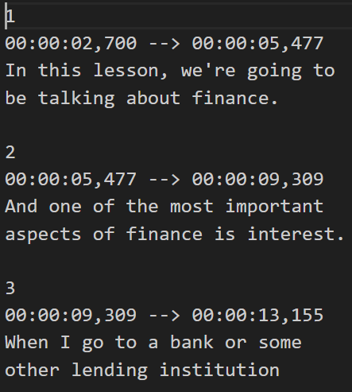

# Internacionalización-Subtitulos
Ampliación del proyecto original (Internacionalización). Soporte para localizar subtítulos.

# Pablo Fernández Álvarez

# Motivación y objetivos

Los subtítulos cumplen varias funciones importantes en los videojuegos:

- En relación con la internacionalización: Son una herramienta para localizar gameplay a través de la traducción de texto. Esta tarea resulta más sencilla
que crear archivos de audio adaptados a cada región, con lo que ello supone (contratar actores de doblaje por cada región, por ejemplo). De esta forma, 
el usuario puede entender el gameplay con los archivos de audio originales, es decir, aquellos creados en la región donde se desarrolló el videojuego, y
por lo tanto, en el idioma usado en dicha región. Es verdad que el idioma de los audios no tiene porqué coincidir con el idioma de la región donde 
se desarrolla un videojuego, pero, por lo general, esto es lo que sucede. Esto también se utiliza en películas, series y demás productos audiovisuales.

- Flexibilidad de volumen: Debido a que los subtítulos proporcionan una segunda vía de comunicación, la principal vía (audio) no es imprescindible. 
De esta forma, el usuario puede ajustar el reducir volumen del audio y seguir entendiendo el gameplay. Esto puede ayudar si el jugador se encuentra en un 
entorno ruidoso o no dispone de un dispositivo de reproducción de audio ( hay muchas clases de jugadores :-P ).

- Ayuda a usuarios con problemas auditivos: Al proporcionar texto sincronizado con el diálogo y otros elementos de sonido en el juego, los subtítulos 
permiten que las personas con dificultades para escuchar o con pérdida auditiva puedan seguir y comprender la historia, las conversaciones y los efectos de sonido.

# Resumen de proyecto de internacionalización

El proyecto tiene como objetivo desarrollar una herramienta de internacionalización y localización en Unity. La localización implica traducir los textos, diálogos y subtítulos al idioma de destino, así como adaptar los gráficos y elementos culturales, como nombres de personajes o referencias culturales, para asegurar que sean apropiados para el público local. Por otro lado, la internacionalización, que consiste en el diseño y desarrollo de código para que sea fácilmente adaptable un juego a diferentes mercados y culturas. La localización e internacionalización son importantes porque permiten a los desarrolladores de videojuegos llegar a audiencias más amplias y diversificadas.

Por un lado, la internacionalización se hará desde el editor de Unity durante el desarrollo del juego, por otro, la localización ocurrirá durante el tiempo de ejecución del juego mediante un manager global. Este sistema estará basado en un diccionario de claves valor. La herramienta estará integrada en el editor de Unity, desde donde se mostrará toda la información necesaria mediante una serie de ventanas emergentes.

Con este sistema se podrá localizar textos, subtítulos, imágenes y música. Se podrán generar claves nuevas, modificar existentes o eliminar las que no se utilicen.

# Subtítulos	

En cuanto a los subtítulos, la idea es crear un motor de subtítulos sencillo, el cuál sepa procesar ficheros con la información de los subtítulos y mostrarlos en pantalla.
Al igual que con los textos, las imágenes y la música, estos subtítulos serán localizabes.

Para entender más a fondo el objetivo de este motor de subtítulos:

El motor seguirá la norma española de subtitulado para sordos UNE-153010: 2012

- Aspecto visuales:
	+ La posición de los subtítulos debe ser estática y debe ubicarse en la parte inferior central de la pantalla. En caso de 
	haber efectos sonores se indicará en la parte superior derecha.
	+ No se deben mostrar más de dos o tres (en caso excepcionales) líneas al mismo tiempo. Además, las líneas deben contener
	como máximo entre 37 y 40 caracteres.
	+ Los subtítulos deben tener un tamaño de tal forma que sean legibles a 2,5 metros de la pantalla.
	+ Por cuestiones de visibilidad, está permitido usar un caja para los subtítulos para crear contraste con el color del fondo.

- Aspectos temporales: 
	+ La velocidad en la que se muestran los subtítulos deberá aproximarse a 15 caracteres por segundo.
	+ La norma hace referencia a la sincronismo visual-auditivo. Para este proyecto no va a afectar ya que simplemente
	se subtitulan audios sin ningún elemento visual vinculado.

- Identificación de personajes:
	+ Se usarán distintos colores en el texto de los subtítulos para distinguir entre las voces de los personajes de
	producto audiovisual.

- Efectos sonoros:
	+ Se mostrarán subtítulos para efectos sonoros siempre que no sean evidentes.
	+ Se colocarán en la parte superior derecha de la pantalla, entre paréntesis y mayúscula inicial.

- Información contextual y voces en off:
	+ Se colocarán en la parte inferior izquierda antes de los propios subtítulos.
	+ Se mostrarán en mayúsculas y entre paréntesis.

- Música y canciones:
	+ Se colocarán y mostrarán igual que los efectos sonoros
	+ Hay 3 formas de mostrarlos: Genero de la música, sensación que transmite o identificando la pieza musical.

- Criterios editoriales:
	+ No afectan al motor de subtitulado ya que el formato del texto debe estar adecuado a la norma.

# Detalles de diseño/implementación

Los subtítulos funcionan como un tipo más de elemento a localizar (texto, subtítulos, audio, imágenes).

Para ello, he ampliado el sistema de internacionalización de la siguiente manera:

## En las clases del Editor:

He añadido un nuevo tipo de elemento localizable al sistema. (LanguageAssets.cs)

En concreto, para representar los subítulos en la herramienta, he usado un pair(string, string).
Esto se debe, a que el primero representa la clave y el segundo el nombre del fichero con la configuración de los
subtítulos. En el apartado del Fichero de Configuración de Subtítulos se explica porque se utiliza este fichero.

Por lo tanto, al igual que con el resto de elementos localizables, se crea un diccionario. (LanguageAssets.cs)

Además, he creado una clase para representar la ventana del editor donde se añadirán las
claves y valores de los subtítulos. (EditorSubtitle.cs)

Por último, he ampliado la clase EditorKey (EditorKey.cs) con la lógica de añadir/eliminar claves
para los subtítulos, así como la de mostrar su ventana en el editor. (EditorKey.cs)

## En las clases del usuario: 

Desde el punto de vista del usuario, existen dos clases: 

- Subtitles: Contiene la lógica de la lectura del fichero de subtítulos y de 
su dibujado en pantalla de manera sincronizada con el audio. En los subtítulos, 
el elemento localizable es el fichero de subtítulos, el cual se obtiene desde 
la clase LocalizedSubtitles.

- LocalizedSubtitles: Se encarga de obtener el fichero de subtítulos localizado
a partir del LocalizationManager. Tras obtener, se lo asigna a la clase Subtitulos.

Por ello, al igual que funciona para otros elementos localizables, ambas componentes
deben pertencer a la misma entidad. Esto pasa con el audio (AudioSource - LocalizedAudio),
con el texto (TextMeshPro - LocalizedText) y con las imágenes (Image - LocalizedImage).

- SubtitlesData: Esta clase no es usable por el usuario y simplemente contiene
los datos necesarios para la implementación de la lógica de la clase Subtitles.

## Fichero de Configuración de Subtítulos

Estos días he estado investigando sobre formatos que se utilizan para representar
subtítulos en la industria del contenido audiovisual, tanto videojuegos como series,
películas... etc. He encontrado varios formatos interesantes pero me he quedado con 
el formato (.srt) SubRib Subtitle. Al parecer es muy utilizado y se adaptaba bien
a la idea que tenía para implementar el motor de subtítulos.

Un ejemplo de un fichero de subtítulos (.srt):

Como se puede ver, es un conjunto de bloques con 3 componentes:

- Indice de bloque: Número entero que representa el bloque actual (Comienza en 1, no en 0)
- Tiempos de inicio y fin: Representan los tiempos en los que el texto debe ser mostrado. Formato HH:MM:SS,mmm --> HH:MM:SS,mmm.
- Texto del subtítulo: Contenido del súbtitulo. Debe acotar la norma de súbtitulos:
	- Deben haber entre 1 y 3 líneas
	- Cada línea debe contener como máximo 40 caracteres 
	- Se deben mostrar aproximadamente 15 caracteres por segundo
	(Esto se calcula dividiendo el número de caracteres total entre el número
	de segundos del archivo de audio correspondiente)
	- En caso de ser un subtitulo especial (efectos sonoros, musica o canciones)
	debe seguir el siguiente formato --> [Subtítulo especial]. Es decir,
	entre llaves y con la primera letra en mayúscula.

Este formato contiene bastante información pero no la suficiente para representar
los subtítulos siguiendo todos los requisitos de la norma. Por ejemplo, faltan
marcar aquellos subtítulos con mala visibilidad o que subtítulo pertenece a cada personaje.
Para ello, he creado un nuevo fichero para subtítulos (JSON) que contiene esta información.

Un ejemplo de este fichero JSON:	

Se utilizan los indices de bloque para indicar que subtitulos son espciales, que subtitulos
dice cada personaje... etc.

- Sounds: Array con los indices de bloque de los subtítulos que son especiales.
- Visibilty: Array con los indices de bloque de los subtítulos que tienen mala visibilidad.
- NSubtitles: Número de subtitulos total.
- Characteres: Array de "Speakers". Personajes que participan en una conversación.
	- Subtitles: Array de indices de bloque de los subtitulos que pertenecen al Speaker.
	- Priority: Indice para representar que color de subtitulo pertenece a cada Speaker.
- File: Fichero (.srt) correspondiente.

# Workflow

El workflow es parecido al del resto de elementos localizables.

Una vez se tenga el fichero de audio y el fichero de subítulos correspondiente (.srt),
se debe crear un JSON con la misma forma que el explicado anteriormente.
Después, en la pestaña del editor Localization/KeyCreator/Audio se debe crear una clave y añadir
el fichero de audio para el idioma correspondiente. Por otra parte, en la pestaña
Localization/KeyCreator/Subtitles, se debe escribir el nombre del fichero JSON correspondiente.

En la escena, se debe añadir a la misma entidad el componente Subtitles y LocalizedSubtitles:

# Resultados obtenidos

## Escena de prueba

En la escena de prueba, hay un audio/grabación de voz por cada idioma,
(Inglés, Español, Francés, Ruso y Japonés) con su fichero de configuración
de subtítulos JSON correspondiente. 

Se recomienda probar cada audio cambiando el idioma por defecto en la pestaña
Localizaction/Languages y ejecutando el juego.

Puede que algún subtítulo no este sincronizado a la perfección. He utilizado
una herramienta para generar .(srt) a partir de un audio pero no es muy precisa.

## Video demostración

https://drive.google.com/file/d/1R3MI83KMqlkSUg_5EtdsAM-l1b3XVs2V/view?usp=sharing

# Conclusiones

Como conclusión, el motor que he implementado se adapta muy bien
a los requisitos de la norma. Pero gran parte de la calidad de unos
subtítulos es responsailidad de los archivos (.srt) por lo que
ahora de subtitular gameplay o cualquier otro producto audiovisual
es muy importante centrarse en que el subtitulado cumpla las normas
y esté correctamente sincronizado con el audio.

